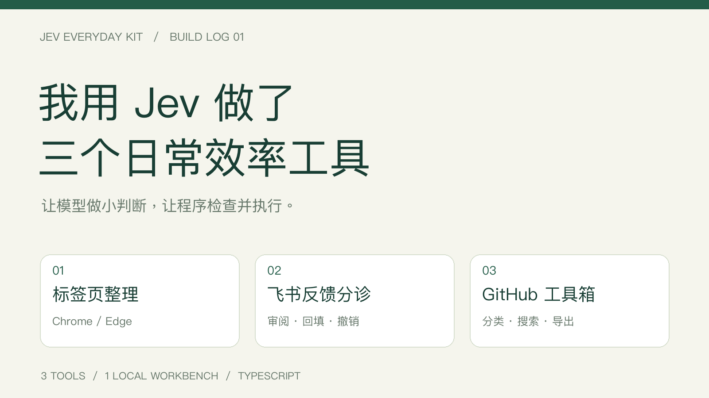
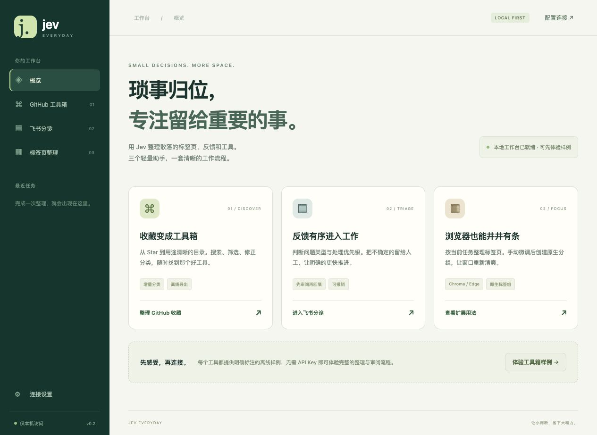

# Jev Everyday Kit · 0.2



[安装与快速开始](#最快开始) · [架构原理](docs/ARCHITECTURE.md) · [效果图库](docs/SHOWCASE.md) · [贡献指南](CONTRIBUTING.md) · [版本记录](CHANGELOG.md)

**把标签页、反馈与收藏，变成可审阅、可修正的工作流程。** TypeScript 开发，Node.js 22+，本地优先；Chrome 扩展 + 飞书集成 + GitHub 工具目录。

> 2026-09-23 本地复测：34 项单元/集成测试 + 9 项端到端测试通过。截图为实际程序的离线演示或测试样例；真实 Jev 推理与平台账号联调边界见 [验证记录](docs/VALIDATION.md)。

三个常用平台的 Jev 工具，加上一个可以直接操作的本地工作台。



| 工具 | 完整使用流程 |
| --- | --- |
| **Chrome / Edge · Tab Sort** | 分批分析标签页 → 搜索、选择和手动调整 → 原生分组 → 保留或撤销。支持进度、停止后继续、排除域名、阈值、分组前缀和折叠偏好。 |
| **飞书 · Feedback Triage** | 配置多维表格 → 检查 / 创建输出列 → 筛选待处理反馈 → 审阅、修正或排除 → 回填 → 查看回执、重试或撤销。 |
| **GitHub · Star Atlas** | 读取 Star 或仓库清单 → 增量分类 → 搜索与多条件筛选 → 人工修正、备注 → 导出 Markdown / JSON / 独立离线网页。附带 GitHub Action。 |

真实模式直接调用 **TypeSafe Jev 官方接口**，让模型判断类别与优先级，再由代码执行有限操作。离线样例明确标注“演示”，不冒充真实推理。

## 最快开始

下载并解压完整安装包，安装 Node.js 22+，在解压目录运行：

```bash
node dist/jev.mjs serve
```

程序只监听 `127.0.0.1`，打印本地地址。**不会自动打开浏览器、安装扩展或弹出桌面窗口。** 方便时由你访问打印出的地址，先试离线样例，再在“连接设置”填凭据。

从源码运行：

```bash
npm ci
npm run build
node dist/jev.mjs serve
```

停止服务用 `Ctrl+C`。已完成任务和回执保存在 `output/studio/`，下次启动可以继续查看。密钥仅在服务内存中；重启后需重新填写，或通过本地 `.env` 提供。端口占用时使用 `--port 4319`，更改数据目录用 `--data /你的目录`。

| 详细说明 | 内容 |
| --- | --- |
| [本地工作台](docs/studio.md) | 连接设置、历史、结果下载、数据保存与恢复 |
| [Chrome 插件](docs/chrome.md) | 安装、原生分组、偏好、继续分析和撤销 |
| [飞书分诊](docs/feishu.md) | 应用权限、表格配置、审阅、回填、重试和撤销 |
| [GitHub 工具箱](docs/github.md) | 收藏分类、缓存、人工修正、导出、Action |
| [验证记录](docs/VALIDATION.md) | 已验证的行为与真实账号验证边界 |

## 命令行也可以独立使用

```bash
# 完全离线的三个工具样例
node dist/jev.mjs demo

# 公开 Star 或指定仓库清单
node dist/jev.mjs github --user YOUR_GITHUB_USERNAME
node dist/jev.mjs github --repos examples/repos.txt --out output/my-tools

# 飞书：先检查和生成计划，再回填
node dist/jev.mjs feishu check --config feishu.local.json
node dist/jev.mjs feishu plan --config feishu.local.json
node dist/jev.mjs feishu apply --plan output/feishu/plan.json
```

命令行自动读取当前目录的 `.env`，模板是 `.env.example`：

- `TYPESAFE_API_KEY`：TypeSafe 官方密钥。
- `JEV_MODEL`：默认 `jev-latest`，支持填写可用的固定版本。
- `GITHUB_TOKEN`：可选，用于 GitHub 读取额度。
- `FEISHU_APP_ID` / `FEISHU_APP_SECRET`：飞书企业自建应用凭据。

Chrome 扩展独立保存它自己的会话密钥，不与工作台共享。详见平台文档。

## 数据与行为

| 工具 | 发送给 TypeSafe | 实际操作 |
| --- | --- | --- |
| Chrome | 页面标题与域名，不发送 URL 路径、查询参数或正文 | 只操作当前窗口预览中的标签页；不关闭页面。完整 URL 在扩展会话中用于变更检查。 |
| 飞书 | 配置的反馈输入列，每条最多 4,000 字符 | 只回填四个指定输出列，检测内容和人工修改；撤销只涉及本次有成功写入记录的内容。 |
| GitHub | 公开仓库名称、简介、topics、语言 | 保存本地工具目录和分类缓存，不修改 Star、不提交、不推送。 |

没有遥测或自建中转。工作台禁止跨站请求，凭据不返回前端、不写入历史。CLI 数据文件使用 `0600` 权限。反馈计划会保留最多 800 字符预览，历史与回执也包含这些工作数据；请保存在个人目录中。

分类同时参考 Jev confidence 和选中项 probability。默认门槛为 75%，可调整；这不是保证准确率。低把握内容保留供人工确认，原始判断与人工修正有区分。

## 构建、测试与分发

```bash
npm run verify          # 类型检查、行为测试、构建
npm run test:e2e        # 独立无头浏览器测试；需要安装 Chromium
npm run verify:all     # 完整验证
npm run package        # 生成并校验两个 ZIP 及 SHA256SUMS
```

缺少测试浏览器时运行 `npx playwright install chromium`。测试始终使用无头模式和临时用户配置，不打开或操控用户现有浏览器。源码包含完整测试，可以重复验证。

产物：

- `dist/jev-everyday-kit-0.2.0.zip`：工作台、CLI、Chrome 扩展、Action、源码、说明和测试。
- `dist/jev-tab-sort-0.2.0.zip`：独立 Chrome / Edge 扩展。
- `dist/SHA256SUMS.txt`：校验值。

这是可本地使用和自行部署的工具套件，尚未发布到应用商店。真实 Jev 账号、飞书租户授权和线上 GitHub 读取仍需配置凭据后验证；模拟平台测试不等于你的真实账号已验收。

## 项目定位与路线

适合个人开发者、小团队的工具收藏和反馈初筛。分类建议不等于正确结论，程序不会自主决定业务处置。后续优先建设真实样本评估、账号联调说明和可访问性；这些属于计划，不是当前已交付能力。

三个工具共享 `packages/core` 的类型化决策适配器。平台副作用分别留在 Chrome、飞书和 GitHub 适配层，本地工作台负责配置、审阅和历史。详见 [架构说明](docs/ARCHITECTURE.md)。

## 许可与支持

源码采用 [MIT License](LICENSE)。第三方依赖遵循各自许可证，分发包附带第三方声明。Jev / TypeSafe、Chrome、飞书和 GitHub 是各自权利人的产品，本项目为独立社区项目，不代表官方合作或认证。

遇到问题请使用 Issue 模板，附版本、最小复现和脱敏错误信息。请勿提交密钥、真实业务反馈、浏览器完整历史或本地任务文件。安全问题见 [SECURITY.md](SECURITY.md)。

接口依据：[TypeSafe 官方文档](https://docs.typesafe.ai/introduction)、[官方 JS SDK](https://github.com/typesafe-ai/typesafe-sdk-js)、[Chrome Tabs](https://developer.chrome.com/docs/extensions/reference/api/tabs)、[飞书多维表格](https://open.feishu.cn/document/server-docs/docs/bitable-v1/app-table-record/search)、[GitHub Starring API](https://docs.github.com/en/rest/activity/starring)。
