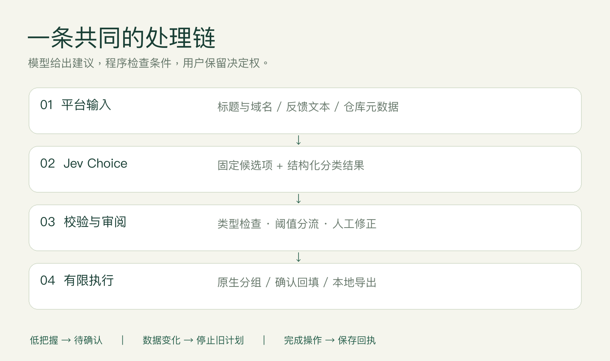

# 架构与设计取舍

## 从小判断到有限操作

输入经过平台适配和最小化处理，交给共享 `choice` 分类器；响应校验后进入阈值分流。用户可以审阅、修正或排除结果，最终由平台代码执行有限操作。这里没有让模型生成并执行任意脚本的机制。

| 目录 | 责任 | 不负责什么 |
| --- | --- | --- |
| `packages/core` | 请求结构、响应验证、批处理、分类维度、离线样例 | 不直接改平台数据 |
| `packages/chrome` | 当前窗口收集、预览、偏好、原生分组与撤销 | 不关闭页面、不读正文 |
| `packages/cli` | 平台读取、计划/回执、缓存、目录导出 | 不自动提交或推送目录 |
| `packages/studio` | 本机界面、会话、任务状态与历史 | 不提供公网多用户服务 |
| `packages/github-action` | 在 Runner 上生成工具目录与输出 | 不自动修改 Star |

## Jev 请求与边界

`packages/core/src/jev.ts` 调用 `https://api.typesafe.ai/v1/systemone`。请求包含模型、state 和命名 questions；本项目使用 `choice`，criteria 是程序定义的有限类别。实际输出检查 choice 是否属于类别集、confidence 和 probabilities 是否位于 0–1、概率分布是否完整。拒绝重定向，限制请求体大小，设置超时，错误信息不回显供应商正文。

类型校验通过只表示结构有效，不表示语义正确。默认同时检查 confidence 与被选类别 probability 是否达到 0.75；这是可调产品阈值，不是经本项目测得的 75% 准确率。业务输入视为待分类数据，不作为新指令执行。

## Tab Sort

当前窗口候选 → 过滤固定、已有分组、无痕、内部页面与排除域名 → 按批分类 → 用户编辑 → 重新核对页面与窗口 → 原生分组。

模型只收到标题、域名；完整 URL 在扩展会话内用于检查标签页是否已导航。停止后保留已完成结果，待处理部分可以继续。应用前的状态校验避免对已经移动或变化的页面执行旧计划。撤销通过记录和原生分组适配器实现，详情见 `operations.ts` 与测试。

## Feedback Triage

反馈类别和优先级是两个问题。系统生成计划时不回填，计划带输入哈希、目标字段与审阅结果。回填前重新读取并比较，保留人工已写入内容；成功操作保存原值和结果到回执。中断重试以回执及当前内容为依据。撤销同样检查当前值，避免覆盖回填后的人工作业。

这是逐条校验、记录进度的流程，不是跨记录数据库事务。网络中断可能使单次结果未知，后续重试需重新读取；不承诺全表原子回滚。演示计划禁止进入真实写入路径。

## Star Atlas

以公开仓库元数据作为分类依据，分开判断用途和产品形态。缓存键包含模型、分类方案、名称、简介、topics 和语言；Star 数变化不触发重新推理。每批结果先保存缓存，后续失败仍可复用。人工修改优先，演示缓存与真实缓存隔离。

目录导出 Markdown、JSON、自包含 HTML；HTML 对不可信文本进行转义，支持离线搜索筛选。项目不读取仓库源码，不生成仓库不存在的能力描述。它整理的是本地目录，不是 GitHub 原生 Star Lists。

## 工作台生命周期

服务只绑定 `127.0.0.1`；检查会话、Origin 和 Host。凭据只保留在进程内存，配置接口不回传密钥；`.env` 属于用户自行保管的输入文件。历史含计划和反馈预览，因此仍是本地工作数据。重启恢复完成记录，运行中任务标记为中断，不自动重启付费推理。

同一平台避免重叠任务。取消在安全边界生效；已发出的写入先等结果和回执保存，再退出。模型、网络和平台故障明确显示，不能用演示结果替代真实失败。

## 验证与后续

单元/集成测试覆盖格式、概率、错误、缓存、幂等、冲突和会话边界；端到端使用独立无头 Chromium 验证实际界面和原生扩展。外部模型及飞书 API 使用契约样例，所以不宣称已经测得线上准确率或延迟。下一阶段可建立匿名样本集，记录不同阈值的覆盖率、人工纠正比例与平均成本。
