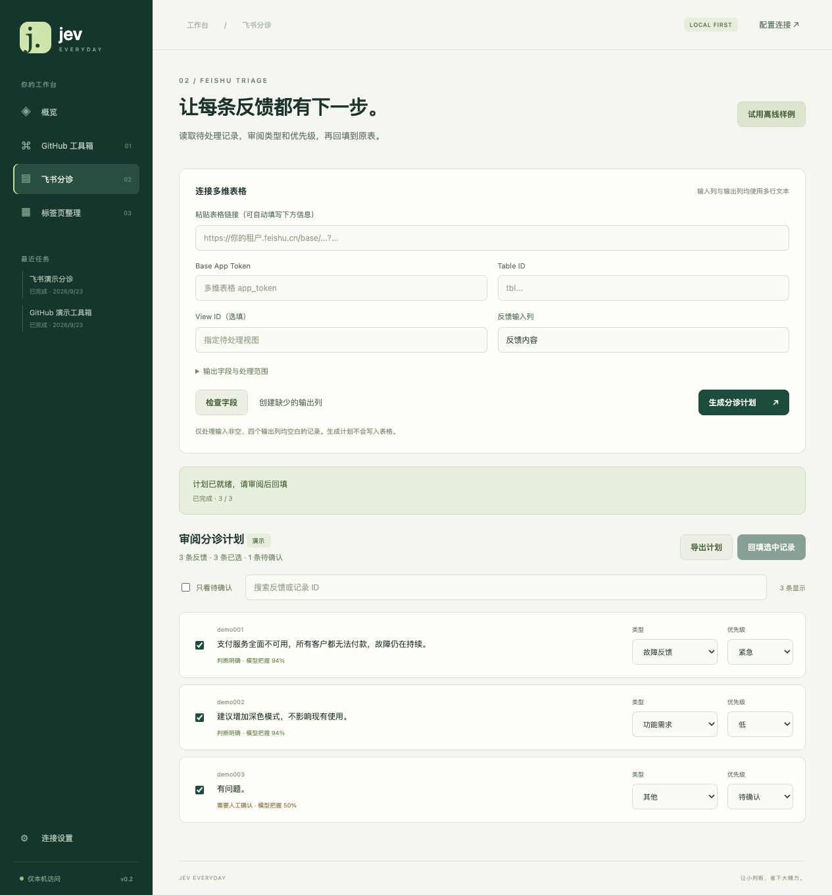
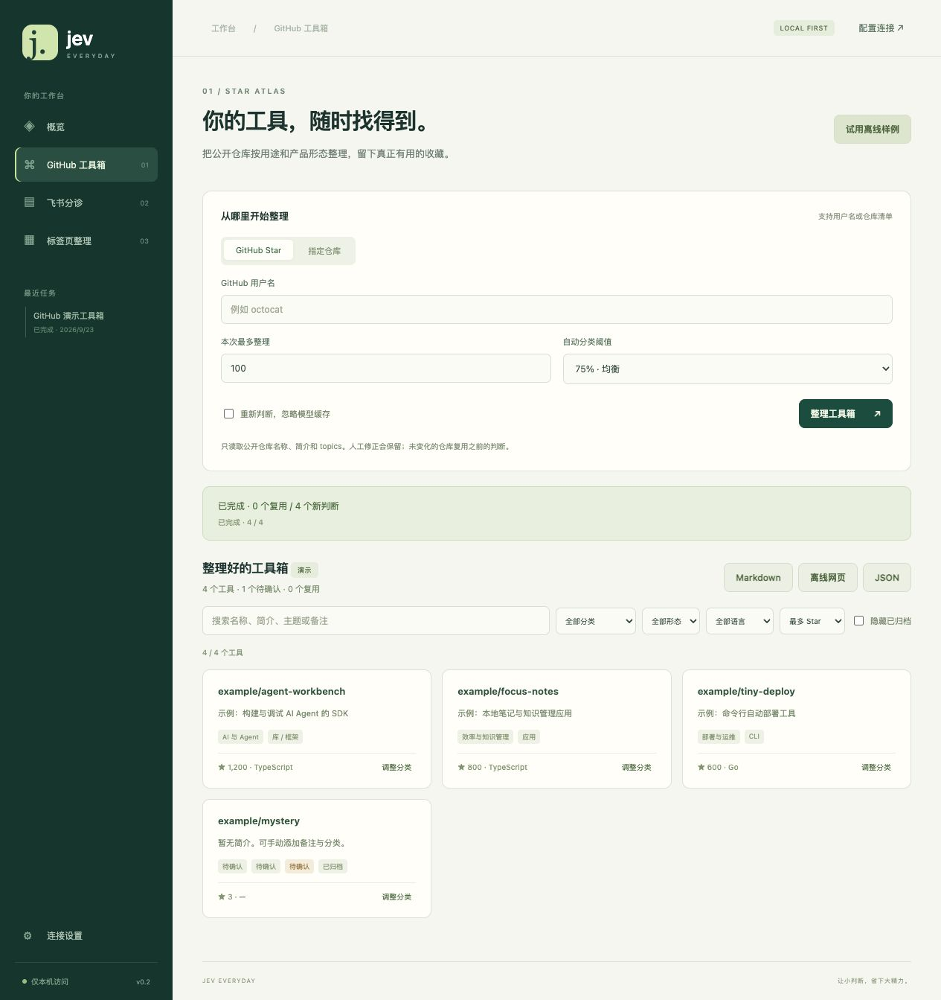

# 项目效果与使用路径

以下为实际程序界面；工作台使用内置离线样例，扩展截图来自模拟模型响应的真实 Chromium 测试。示例仓库与业务反馈不代表真实用户或线上推理效果。

## 一套本地工作台

## Chrome / Edge：Tab Sort

分析当前窗口、审阅并调整类别、应用原生分组、按需要撤销。详见 [安装步骤](chrome.md)。

## 飞书：Feedback Triage

检查字段、读取待处理反馈、审阅类别与优先级、确认回填。演示界面不允许写入真实平台。详见 [配置步骤](feishu.md)。

## GitHub：Star Atlas

按用途与形态整理公开仓库，支持筛选、人工修正、增量缓存和三种导出。详见 [使用说明](github.md)。

## 共同原理

模型负责有限分类，程序负责校验，用户审阅结果。详细实现见 [架构文档](ARCHITECTURE.md)。
